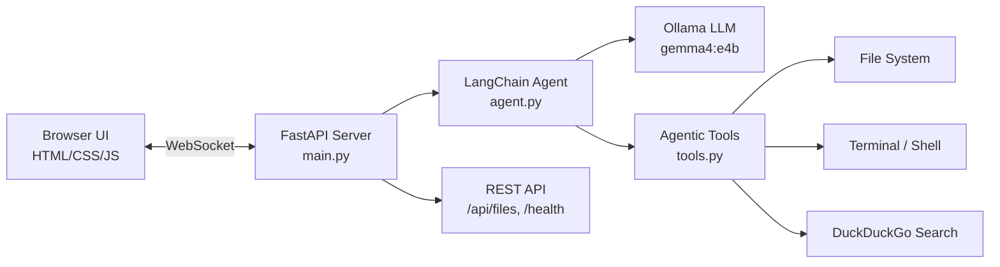

# JARVIS AI — Full Project Documentation

> **Author:** Kaiser_69420 (`darkknight2007-ctrl`)  
> **Repository:** [github.com/darkknight2007-ctrl/JARVIS_AI](https://github.com/darkknight2007-ctrl/JARVIS_AI)  
> **Last Updated:** April 7, 2026

---

## Project Overview

JARVIS (Just A Rather Very Intelligent System) is a **fully local, agentic AI assistant** for web development and general-purpose help. It runs 100% on-device using **Ollama** — zero cloud services, zero API keys, complete privacy.

| Property | Value |
|---|---|
| **Language** | Python (backend), HTML/CSS/JS (frontend) |
| **AI Framework** | LangChain + LangGraph |
| **LLM Provider** | Ollama (local) |
| **Current Model** | `gemma4:e4b` |
| **Server** | FastAPI + Uvicorn |
| **Communication** | WebSocket (real-time streaming) |
| **Search Engine** | DuckDuckGo (`ddgs` library) |

---

## Architecture



---

## Version History

### v1.0 — Initial Release *(April 5, 2026)*
**Commit:** `cd84d79` — *"JARVIS v1.0 initial commit - local AI agent with memory and tools"*

This was the foundation. Everything was built from scratch in a single session:

| Component | What was created |
|---|---|
| [main.py](file:///Users/vishnu/Desktop/VS%20CODE/JARVIS/backend/main.py) | FastAPI server with WebSocket endpoint for real-time token streaming |
| [agent.py](file:///Users/vishnu/Desktop/VS%20CODE/JARVIS/backend/agent.py) | LangChain agent with JARVIS personality system prompt, conversation memory |
| [tools.py](file:///Users/vishnu/Desktop/VS%20CODE/JARVIS/backend/tools.py) | 5 agentic tools: `read_file`, `write_file`, `list_directory`, `create_directory`, `run_terminal_command` |
| [index.html](file:///Users/vishnu/Desktop/VS%20CODE/JARVIS/frontend/index.html) | Full chat UI with sidebar, JARVIS logo, capabilities panel, quick prompts |
| [style.css](file:///Users/vishnu/Desktop/VS%20CODE/JARVIS/frontend/style.css) | Dark cyberpunk theme with glassmorphism, animated particle canvas, CSS variables |
| [app.js](file:///Users/vishnu/Desktop/VS%20CODE/JARVIS/frontend/app.js) | WebSocket client, streaming token renderer, markdown parser with syntax highlighting |
| [.env](file:///Users/vishnu/Desktop/VS%20CODE/JARVIS/backend/.env) | Environment config for model name, Ollama URL, port |
| [README.md](file:///Users/vishnu/Desktop/VS%20CODE/JARVIS/README.md) | Setup guide, startup instructions, project structure |
| .gitignore | Ignores `.env`, `__pycache__`, `node_modules`, `.DS_Store` |

**Key Decisions:**
- Chose WebSocket over HTTP polling for instant token-by-token streaming
- Used `marked.js` + `highlight.js` for rich code rendering in chat bubbles
- Built animated particle background canvas for premium aesthetics

---

### v1.1 — Roadmap & GitHub *(April 5, 2026)*
**Commit:** `e0ad055` — *"docs: Add ROADMAP.md to track future features"*

| What changed | Details |
|---|---|
| [ROADMAP.md](file:///Users/vishnu/Desktop/VS%20CODE/JARVIS/ROADMAP.md) | Created a future feature roadmap with 6 planned upgrades |

**Planned features documented:**
1. Vision Integration (LLaVA)
2. File Explorer Panel
3. Web Search Engine
4. Project Scaffolders
5. Theme Engine
6. Git/GitHub Integration in UI

---

### v1.2 — Agentic Upgrades + Critical Bugfixes *(April 5, 2026)*
**Commit:** `74ef535` — *"feat: Add Agentic Web Search, Project Scaffolder, and UI bugfixes"*

This was a major update that both fixed showstopping bugs and added 3 new tools.

#### Bugs Fixed

| Bug | Root Cause | Fix |
|---|---|---|
| **Chat bubbles not scrolling** | `scroll-behavior: smooth` in CSS conflicted with rapid token streaming, paralyzing the scrollbar | Removed `scroll-behavior: smooth` from `.messages` container |
| **AI reusing old chat bubbles** | Every assistant bubble was given `id="streaming-bubble"`, so `getElementById` always returned the first bubble | Changed to dynamically unique IDs: `id="bubble-" + Date.now()` |
| **Empty chat bubbles / invisible responses** | The `gemma4` model wraps reasoning in `<think>` HTML tags, which browsers hide as unknown elements | Added regex in `parseMarkdown()` to convert `<think>` tags into visible markdown blockquotes |

#### New Tools Added

| Tool | File | Purpose |
|---|---|---|
| `get_current_time` | [tools.py](file:///Users/vishnu/Desktop/VS%20CODE/JARVIS/backend/tools.py) | Returns current date/time so JARVIS can answer "what time is it?" |
| `search_web` | [tools.py](file:///Users/vishnu/Desktop/VS%20CODE/JARVIS/backend/tools.py) | Queries DuckDuckGo for real-time web results (news, docs, prices) |
| `scaffold_project` | [tools.py](file:///Users/vishnu/Desktop/VS%20CODE/JARVIS/backend/tools.py) | Runs `npx create-vite` or `npx create-next-app` to scaffold full frameworks |

#### Other Changes
- Migrated from deprecated `duckduckgo-search` pip package → new `ddgs` package
- Updated system prompt in `agent.py` to document the 3 new tools
- Added startup & restart instructions to `README.md`
- Marked Features 3 & 4 as complete in `ROADMAP.md`

---

### v1.3 — File Explorer Panel *(April 7, 2026)*
**Commit:** `ead143f` — *"feat: implement interactive file explorer UI and backend directory tree API"*

| What changed | Details |
|---|---|
| [main.py](file:///Users/vishnu/Desktop/VS%20CODE/JARVIS/backend/main.py) | Added `GET /api/files` REST endpoint + `get_dir_tree()` recursive function |
| [index.html](file:///Users/vishnu/Desktop/VS%20CODE/JARVIS/frontend/index.html) | Added File Explorer section in sidebar with refresh button |
| [style.css](file:///Users/vishnu/Desktop/VS%20CODE/JARVIS/frontend/style.css) | Added `.file-tree-container`, `.tree-node`, `.tree-folder`, `.tree-children` styles |
| [app.js](file:///Users/vishnu/Desktop/VS%20CODE/JARVIS/frontend/app.js) | Implemented `fetchFileTree()` and `createTreeNode()` with click-to-expand folders |
| Git config | Configured globally as `Kaiser_69420` / `nvish2007@gmail.com` |

**Key Features:**
- Recursive directory tree fetched from Python backend
- Folders are clickable and expand/collapse with icon changes (📁→📂)
- Files are clickable — auto-injects path into chat input for quick prompting
- Ignores `.git`, `node_modules`, `venv`, `__pycache__`, and hidden files
- Refresh button (↻) to re-fetch the tree after JARVIS creates new files

---

## Current Project Structure

```
JARVIS/
├── backend/
│   ├── main.py              # FastAPI server (6 endpoints + WebSocket)
│   ├── agent.py             # LangChain agent + JARVIS personality
│   ├── tools.py             # 8 agentic tools
│   ├── requirements.txt     # Python dependencies
│   ├── .env                 # Local environment config
│   └── array_rotator.js     # Test file created by JARVIS
├── frontend/
│   ├── index.html           # Chat UI with sidebar + file explorer
│   ├── style.css            # Dark cyberpunk theme (400+ lines)
│   └── app.js               # WebSocket client + file tree logic (450+ lines)
├── README.md                # Startup guide + restart instructions
├── ROADMAP.md               # Feature tracking
└── .gitignore
```

---

## Current Tool Inventory (8 Tools)

| # | Tool | Description |
|---|---|---|
| 1 | `read_file` | Read any file on the local filesystem |
| 2 | `write_file` | Create or update files with full content |
| 3 | `list_directory` | Explore folder structure with emoji icons |
| 4 | `create_directory` | Scaffold new directories recursively |
| 5 | `run_terminal_command` | Execute shell commands (with safety blocklist) |
| 6 | `get_current_time` | Returns formatted current date and time |
| 7 | `search_web` | Live DuckDuckGo search for real-time info |
| 8 | `scaffold_project` | Scaffolds Vite or Next.js projects via npx |

---

## API Endpoints

| Method | Path | Description |
|---|---|---|
| `GET` | `/` | Serves the frontend UI |
| `GET` | `/health` | Returns server status and model name |
| `GET` | `/history` | Returns conversation history |
| `POST` | `/clear` | Clears conversation memory |
| `GET` | `/api/files` | Returns recursive directory tree as JSON |
| `WS` | `/ws` | Real-time WebSocket for chat streaming |

---

## Roadmap Status

| # | Feature | Status |
|---|---|---|
| 1 | Vision Integration | ⬜ Planned |
| 2 | File Explorer Panel | ✅ Complete |
| 3 | Web Search Engine | ✅ Complete |
| 4 | Project Scaffolders | ✅ Complete |
| 5 | Theme Engine | ⬜ Planned |
| 6 | Git/GitHub Integration in UI | ⬜ Planned |

---

## Dependencies

| Package | Purpose |
|---|---|
| `fastapi` | Web server framework |
| `uvicorn` | ASGI server |
| `websockets` | WebSocket support |
| `python-dotenv` | Environment variable loading |
| `langchain` | Agent framework |
| `langchain-ollama` | Ollama LLM integration |
| `langgraph` | Agent execution graph |
| `ddgs` | DuckDuckGo web search |
| `langchain-community` | Community tools and utilities |

---

## How to Run

```bash
# 1. Start Ollama
ollama serve

# 2. Start JARVIS
cd "/Users/vishnu/Desktop/VS CODE/JARVIS/backend"
python3 main.py

# 3. Open browser
# http://localhost:8000
```

**To restart:** Press `Ctrl+C` in terminal → `Up Arrow` → `Enter` → Refresh browser (`Cmd+Shift+R`)
